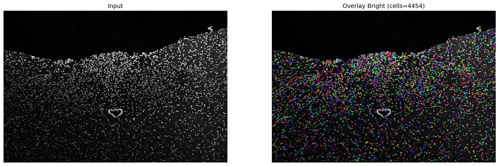

# 🧬 Cocofluo

**Cocofluo** is an automated bioimage analysis pipeline for confocal microscopy images, designed to perform robust single-cell segmentation and enable downstream fluorescence detection and colocalization analysis.

Cocofluo focuses on extracting reliable single-cell level information from large multi-channel confocal images, serving as the foundation for quantitative biological analysis.

---

## 🔬 Project Overview

Cocofluo targets confocal RNAscope images that typically contain:

- A structural cell channel (cell body / nucleus)
- Multiple fluorescence marker channels

The current stage of the project focuses on:

- Automatic instance segmentation of all cells in large confocal images  
- Generating accurate cell masks as the spatial reference system  
- Providing visualization and quality control tools  
- Building the foundation for per-cell fluorescence analysis and colocalization

In the next stages, Cocofluo will support:

- Single-cell fluorescence quantification  
- Marker overlap and colocalization detection  
- Per-cell feature extraction and statistics  
- End-to-end automated experimental pipelines  

---

## 🧠 Core Idea

Instead of treating the image as a whole, Cocofluo treats **each cell as an independent analysis unit**.

All downstream fluorescence measurements and colocalization decisions are performed based on automatically segmented single-cell regions.

This design allows Cocofluo to scale from raw microscopy images to structured single-cell level biological data.

---

## 🚧 Current Status

Cocofluo is under active development.  
The current pipeline supports:

- Multi-channel confocal image loading  
- Preprocessing and normalization  
- Deep learning–based cell instance segmentation (Cellpose-based)  
- Mask export and visualization for quality control  

Colocalization and quantitative analysis modules are under construction.

---

## 📌 Project Name

Cocofluo = **Co**nfound + **Co**localization + **Fluo**rescence  
A system designed for confocal fluorescence understanding.

---

## 📷 Typical Workflow (Conceptual)

Confocal image → Cell segmentation → Single-cell masks →  
Fluorescence extraction → Colocalization detection → Quantitative outputs

---

## 🖼️ Result Preview (Segmentation Overlay)

An example visualization comparing the input structural channel and the predicted Cellpose instance masks (overlay):

---

## 📄 License

This project is for research and development purposes.  
License will be specified in future releases.
