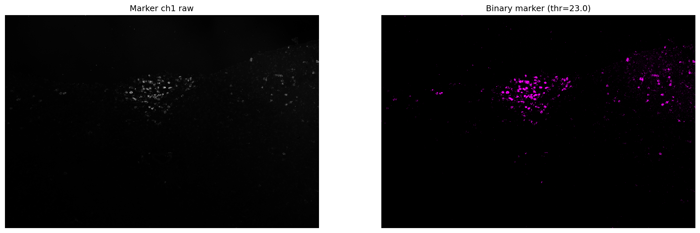
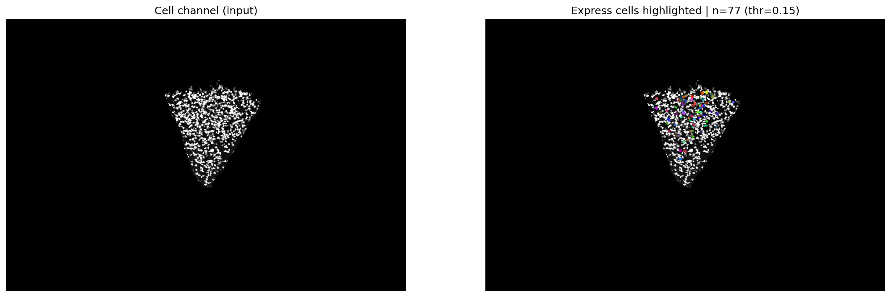

# 🧬 Cocofluo

**Cocofluo** is an automated bioimage analysis pipeline for confocal microscopy images. It performs robust single-cell instance segmentation, fluorescence marker extraction, express-cell quantification, and colocalization analysis at the individual cell level.

---

## 🔬 Project Overview

Cocofluo targets confocal images (e.g. RNAscope) that typically contain:

- A **structural cell channel** (cell body / nucleus)
- Multiple **fluorescence marker channels**

The pipeline treats **each cell as an independent analysis unit**:

1. **Instance segmentation** — Identify every cell in the field of view
2. **Marker extraction** — Binarize each fluorescence channel via percentile threshold
3. **Express analysis** — A cell "expresses" a marker if marker-positive area / cell area ≥ threshold
4. **Colocalization** — A cell colocalizes markers A & B if it expresses both; supports 2-way or 3-way groups

---

## 🚀 Quick Start

```bash
cd pipeline
python main.py
```

**Before running:**  
- Place multi-channel TIFFs in `pipeline/source/`  
- Adjust `pipeline/config.py` (DAPI channel, marker names, thresholds, etc.)

---

## 📁 Directory Structure

```
cocofluo/
├── pipeline/
│   ├── main.py           # Main pipeline entry
│   ├── config.py         # All parameters
│   ├── cocofluo.ipynb    # Exploratory notebook
│   ├── source/           # Input TIFFs
│   ├── result/           # report.csv
│   └── sampling/         # QC images (every 10th file)
├── cell_results/         # Notebook outputs (masks, overlays, etc.)
└── readme.md
```

---

## ⚙️ Configuration

Edit `pipeline/config.py`:

| Parameter | Description |
|-----------|-------------|
| `N_CHANNELS` | Number of channels |
| `DAPI_CH` | Structural channel index (1-based) |
| `CHANNEL_NAMES` | Display names per channel |
| `MARKER_EXTRACT_PERCENTILE` | Top (100-P)% pixels = marker positive |
| `MARKER_EXPRESS_THRESHOLD` | Express if marker_area/cell_area ≥ this |
| `COLOCALIZATION_GROUPS` | e.g. `[(2,3), (2,4), (2,3,4)]` for 2-way and 3-way colocalization |

---

## 📊 Output

### Report (`result/report.csv`)

Each row = one image. Columns:

- `file` — Image name (no extension)
- `num_cells` — Total cells detected
- `express_{marker}` — Count of cells expressing each marker
- `coloc_{marker1}_{marker2}[_{marker3}]` — Count of cells expressing all markers in the group

### Sampling QC (`sampling/`)

Every 10 images, three comparison figures are saved:

| File | Left panel | Right panel |
|------|------------|-------------|
| `{base}_cellseg_sampling.png` | Raw DAPI | Colored segmentation overlay |
| `{base}_markerextract_{ch}_sampling.png` | Raw marker | Colored binary mask |
| `{base}_express_{ch}_sampling.png` | Raw DAPI | Express cells highlighted |

---

## 🖼️ Result Preview

### Segmentation Overlay

Left: raw DAPI. Right: colored instance segmentation overlay.


### Marker Extraction

Left: raw fluorescence marker. Right: percentile-thresholded binary mask (colored).



### Express Cells

Left: raw DAPI. Right: express cells highlighted with colors (marker-positive area / cell area ≥ threshold).



---

## 📌 Project Name

**Cocofluo** = **Co**nfound + **Co**localization + **Fluo**rescence  
A system for confocal fluorescence understanding.

---

## 📄 License

Research and development use. License to be specified.
